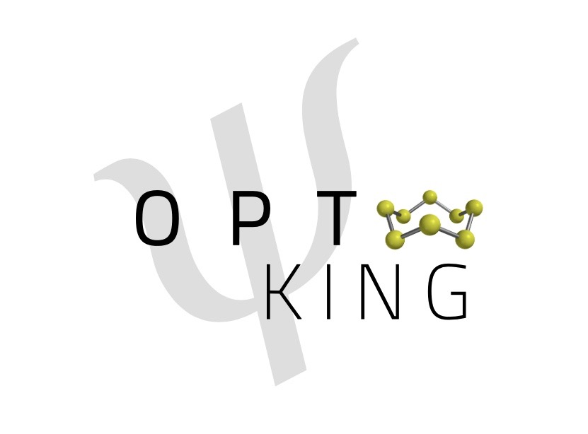
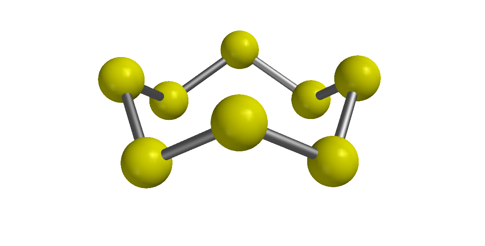

.. pyoptking documentation master file, created by
   sphinx-quickstart on Wed Jul 25 16:46:02 2018.
   You can adapt this file completely to your liking, but it should at least
   contain the root `toctree` directive.

Welcome to pyoptking's documentation!
=====================================

.. toctree::
   :maxdepth: 2
   :caption: Contents:

   optimizations
   options
   algorithms
   molecule
   coords

Indices and tables
==================

* :ref:`genindex`
* :ref:`modindex`
* :ref:`search`
